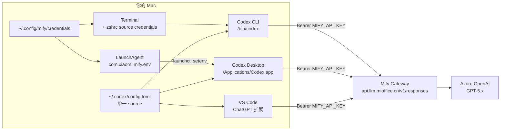

<!-- feishu: https://feishu.cn/wiki/HZILwO53HiRMxZk2wSTcULSPnDh -->

<callout emoji="memo" background-color="pale-gray">

**适用场景**：把 OpenAI Codex（Desktop app 和 CLI）从官方 OpenAI 登录切换到小米 Mify 网关，跑公司自有的 Azure GPT-5.x 系列模型，不消耗个人 ChatGPT 订阅额度。

**核心结论**：Codex 走 Mify 这条路**物理可行**，但**只能跑 Azure OpenAI 通道的模型**（GPT-5.4 / GPT-5.3-codex / 等）。MiMo / Kimi / Qwen 等国产模型因为 Mify 的 `/v1/responses` 端点白名单和 Codex 的 `wire_api` 硬约束，挂不到 Codex 里 —— 它们应留在 Claude Code 这类还支持 chat completions 协议的客户端。

</callout>

## TL;DR：最终形态

<lark-table column-widths="170,360,180" header-row="true">
<lark-tr>
<lark-td>

**组件**

</lark-td>
<lark-td>

**存在形式**

</lark-td>
<lark-td>

**生效范围**

</lark-td>
</lark-tr>
<lark-tr>
<lark-td>

`~/.codex/config.toml`

</lark-td>
<lark-td>

`model_provider = "mify"` + `wire_api = "responses"` + `model = "azure_openai/gpt-5.4"` + `requires_openai_auth = true`；provider display name 自动跟随当前 model

</lark-td>
<lark-td>

Desktop + CLI（共享同一份 config）

</lark-td>
</lark-tr>
<lark-tr>
<lark-td>

`MIFY_API_KEY` source of truth

</lark-td>
<lark-td>

`~/.config/mify/credentials`（mify-model-gateway skill 的 `install_token.py` 写入）

</lark-td>
<lark-td>

所有进程的最终 key 来源

</lark-td>
</lark-tr>
<lark-tr>
<lark-td>

Terminal / CLI 的 env

</lark-td>
<lark-td>

`~/.zshrc` 末尾：`source ~/.config/mify/credentials`

</lark-td>
<lark-td>

Terminal / Codex CLI

</lark-td>
</lark-tr>
<lark-tr>
<lark-td>

GUI app 的 env（关键坑）

</lark-td>
<lark-td>

LaunchAgent `com.xiaomi.mify.env`，登录时自动从 credentials 注入 `launchctl setenv`

</lark-td>
<lark-td>

Codex Desktop / Claude Desktop 等 GUI 进程

</lark-td>
</lark-tr>
<lark-tr>
<lark-td>

切 model（日常）

</lark-td>
<lark-td>

`codex-model <slug>` zsh 函数（改 config.toml 的 model + 同步 display name）

</lark-td>
<lark-td>

需 Cmd+Q 重启 Desktop；CLI 用 `-m` 更灵活

</lark-td>
</lark-tr>
<lark-tr>
<lark-td>

一键回退官方

</lark-td>
<lark-td>

`cp ~/.codex/config.toml.bak.YYYYMMDD-HHMMSS ~/.codex/config.toml`

</lark-td>
<lark-td>

瞬间回到 OpenAI 官方登录态

</lark-td>
</lark-tr>
</lark-table>

## 架构链路



## 日常使用：切模型

### 方式 1 —— `codex-model` 函数（改 config，Desktop + CLI 共同生效）

```shell
# 无参：查当前 model + 打印帮助
codex-model

# 切到代码特化模型
codex-model azure_openai/gpt-5.3-codex

# 切回默认主力
codex-model azure_openai/gpt-5.4

# 常用候选
codex-model azure_openai/gpt-5.4-pro       # 更强，更慢
codex-model azure_openai/gpt-5.2-codex
codex-model azure_openai/gpt-5.1-codex
```

<callout emoji="warning" background-color="light-yellow">

**Desktop 生效需 Cmd+Q 重启** —— Desktop 只在启动时读 config.toml 一次。CLI 每次启动都读最新 config，不受影响。函数最后一行会打印 `→ Cmd+Q Codex Desktop and reopen to apply.` 提醒你。

</callout>

### 方式 2 —— CLI inline override（不改 config，用完就忘）

```shell
# 指定 model 启动 interactive TUI
codex -m azure_openai/gpt-5.3-codex

# 一次性 exec（scripting 场景）
codex exec --skip-git-repo-check --sandbox read-only -m azure_openai/gpt-5.4 \
  "Summarize this file in 3 bullets" < README.md

# 更硬核：override 任意 config 字段
codex -c model=azure_openai/gpt-5.2-codex -c model_reasoning_effort=high
```

<callout emoji="bulb" background-color="light-blue">

CLI 的 `-m` / `-c` 是**临时**的，只对这一次会话生效。不改 config.toml，不用 Cmd+Q 重启。是 CLI 比 Desktop 最大的灵活性优势。

</callout>

## 首次配置（新机器 / 重装参考）

### 前置

1. `~/.config/mify/credentials` 里有 `sk-` 开头的 MIFY_API_KEY（走 `mify-model-gateway` skill 的 `install_token.py` 装）
2. `~/.zshrc` 末尾有 `source ~/.config/mify/credentials`
3. Codex Desktop 从 [openai.com/codex](https://openai.com/codex) 下载安装到 `/Applications/`

### Step 0 —— 清理旧的 OpenAI 登录态（如果之前用过 ChatGPT 方式登 Codex）

<callout emoji="warning" background-color="light-yellow">

**如果你之前用 "Sign in with ChatGPT" 登过 Codex**，`~/.codex/auth.json` 里会留下 `refresh_token`。Codex Desktop 每次启动都会无条件去刷这个 token，国内 IP 会被 OpenAI 以 `unsupported_country_region_territory` 403 拒绝，`codex app-server` 子进程反复崩溃 → UI 卡死进不去（详见「坑 6」）。

```shell
# 先挪走（保留好，想恢复可以 mv 回来）
mv ~/.codex/auth.json ~/.codex/auth.json.openai-bak-$(date +%Y%m%d-%H%M%S)
```

`install.py --apply` 在 phase 2 会自动检测并执行这一步，但如果你走手动路径，**这步必须在第一次打开 Codex Desktop 之前做**，不然就得重开一次。

</callout>

### Step 1 —— config.toml 配置

```toml
# ~/.codex/config.toml
model                  = "azure_openai/gpt-5.4"
model_provider         = "mify"
model_reasoning_effort = "low"

[model_providers.mify]
name     = "gpt-5.4"                               # 纯 display，codex-model 函数会同步
base_url = "https://api.llm.mioffice.cn/v1"
env_key  = "MIFY_API_KEY"
wire_api = "responses"                              # ⚠️ 必须是 responses，chat 在 PR #10157 被删
requires_openai_auth = true                         # ⚠️ Desktop UI picker 的 workaround
```

### Step 2 —— GUI env 持久化（LaunchAgent）

写 plist 到 `~/.config/mify/com.xiaomi.mify.env.plist`：

```xml
<?xml version="1.0" encoding="UTF-8"?>
<!DOCTYPE plist PUBLIC "-//Apple//DTD PLIST 1.0//EN" "http://www.apple.com/DTDs/PropertyList-1.0.dtd">
<plist version="1.0">
<dict>
    <key>Label</key><string>com.xiaomi.mify.env</string>
    <key>ProgramArguments</key>
    <array>
        <string>/bin/zsh</string>
        <string>-c</string>
        <string>source "$HOME/.config/mify/credentials" &amp;&amp; launchctl setenv MIFY_API_KEY "$MIFY_API_KEY"</string>
    </array>
    <key>RunAtLoad</key><true/>
</dict>
</plist>
```

从 Finder 拖到 `~/Library/LaunchAgents/`（`cp` 通常会被 macOS TCC 拦），然后：

```shell
launchctl bootstrap gui/$(id -u) ~/Library/LaunchAgents/com.xiaomi.mify.env.plist

# 验证（模拟重启）
launchctl unsetenv MIFY_API_KEY
launchctl kickstart -k "gui/$(id -u)/com.xiaomi.mify.env"
sleep 1
launchctl getenv MIFY_API_KEY | cut -c1-8   # 应该打印 sk-baHqK...
```

### Step 3 —— zshrc 安装 `codex-model` 函数

```shell
# ~/.zshrc 末尾追加
codex-model() {
  local cfg="$HOME/.codex/config.toml"
  local m="$1"
  if [ -z "$m" ]; then
    local current=$(awk -F'"' '/^model[[:space:]]*=[[:space:]]*"/ {print $2; exit}' "$cfg")
    cat <<USAGE
Current Codex model: ${current:-<not set>}

Usage: codex-model <model_slug>

Verified on Mify Responses API (Codex-compatible):
  codex-model azure_openai/gpt-5.4          # reasoning flagship (default)
  codex-model azure_openai/gpt-5.4-pro      # stronger, slower
  codex-model azure_openai/gpt-5.3-codex    # code-specialized, fast
  codex-model azure_openai/gpt-5.2-codex
  codex-model azure_openai/gpt-5.1-codex

After switching: Cmd+Q Codex Desktop and reopen to apply.
USAGE
    return
  fi
  if ! grep -qE '^model[[:space:]]*=[[:space:]]*"[^"]+"' "$cfg"; then
    echo "codex-model: cannot find top-level 'model = \"...\"' in $cfg" >&2
    return 1
  fi
  # 1. 更新 top-level model
  sed -i '' -E "s|^model[[:space:]]*=[[:space:]]*\"[^\"]+\"|model                  = \"$m\"|" "$cfg"
  # 2. 同步 provider display name（剥掉 owner 前缀，只留 model id）
  local short="${m#*/}"
  sed -i '' -E "s|^name[[:space:]]*=[[:space:]]*\"[^\"]*\"|name     = \"$short\"|" "$cfg"
  echo "✓ Codex model → $m"
  echo "  display name → $short"
  echo "→ Cmd+Q Codex Desktop and reopen to apply."
}
```

### Step 4 —— 首次启动 Desktop 过假登录

Desktop 打开会弹 "Sign in with OpenAI / Sign in with an API key"：选 **API key** → **随便输几个字符**（`xxx`、`dummy` 都行）→ 回车。会进主界面。这是 `requires_openai_auth = true` 的副作用，**不是真认证**，GUI 只是需要这一步放行。

### Step 5 —— 验证

```shell
# CLI smoke test
codex exec --skip-git-repo-check --sandbox read-only \
  "Reply with exactly this one word and nothing else: working"
# 期望：Header 显示 provider: mify, model: azure_openai/gpt-5.4
# 期望：codex 回复 working
```

## 关键设计决策（踩过的坑）

### 坑 1：`wire_api = "chat"` 已被永久删除

<callout emoji="x" background-color="light-red">

**Codex PR #10157（2026 年 2 月合并）永久删除了 `wire_api = "chat"` 支持**。现在唯一合法值是 `"responses"`。没有 fallback flag、没有 hidden override。

</callout>

证据：Codex binary 里 grep 的 error template 原话：

```
`wire_api = "chat"` is no longer supported.
How to fix: set `wire_api = "responses"` in your provider config.
```

Gemini 等 LLM 可能仍推荐 `wire_api = "chat"` 或 `"chat_completions"`，**都是幻觉**（binary strings 里根本没有 `chat_completions` 这个值）。遇到 LLM 给出配置值拿不准时，最快验证法：

```shell
strings /Applications/Codex.app/Contents/Resources/codex | grep -i "wire_api\|unknown"
```

### 坑 2：Mify 的 `/v1/responses` 只代理 Azure OpenAI 通道

<callout emoji="fire" background-color="light-orange">

Mify 在 `/v1/responses` 前做了**前置白名单**：非 `azure_openai/*` 的 model 直接 400 拒绝：

```json
{"error":{"message":"/v1/responses only supports provider `azure_openai`,
                     but got `xiaomi` for model `mimo-v2.5-pro`."}}
```

**这意味着 MiMo / Kimi / Qwen 等国产模型无法挂 Codex**（Codex 必须用 `wire_api = "responses"`，但 Mify 的 responses 端点不支持这些通道）。

</callout>

这是 Mify 侧的产品决策：Azure 上游原生吐 Responses 格式，Mify 做透传即可；xiaomi / tongyi / ppio 上游只吐 Chat Completions，要在 `/v1/responses` 上响应它们需要写 chat→responses 的实时翻译层（含 tool_use 结构重建、reasoning block），工程和信息损耗都不划算，因此未实现。

**绕路方案**：本地跑 LiteLLM Proxy（官方有 Codex tutorial）做 Responses↔Chat 翻译。但 tool use / reasoning 翻译有 loss，不建议用于 Codex 的 agent 模式。MiMo 这类用**还原到 Claude Code** 这类接受 chat completions 的客户端更合适。

### 坑 3：Codex Desktop UI 对 custom provider 的 picker 是"死的"

<callout emoji="bulb" background-color="light-blue">

Codex Desktop 的模型选择器 UI **只对 OpenAI / Azure 原生 provider 亮灯可交互**。Mify 作为 custom provider，picker 显示 provider name 但**无可选项可点**。

</callout>

**切 model 的唯一路径**：改 `~/.codex/config.toml` 的顶层 `model` 字段 + Cmd+Q 重启 Desktop。`codex-model` 函数正是为此设计的。

想激活 picker 曾尝试把 section key 改成 `[model_providers.azure]`（蹭 built-in），**失败**：Codex 对 azure provider 会按 Azure-native `/deployments/{id}/responses` 路径发请求，Mify 侧不支持这个 path（只支持 `/v1/responses` unified path），测试返回 404。两边路由哲学相反，物理堵死。

### 坑 4：GUI app 读不到 zshrc 的环境变量

<callout emoji="warning" background-color="light-yellow">

从 Dock / Finder 启动的 GUI app 走 **launchd 环境**，不是 login shell。所以 `~/.zshrc` 里 source 的 `MIFY_API_KEY` 只对终端生效，Codex Desktop 读不到。

</callout>

**解决**：LaunchAgent 在登录时把 key 从 `~/.config/mify/credentials` 注入到 launchd user GUI domain（通过 `launchctl setenv`）。这样 GUI app 启动时就能读到。

**未装 LaunchAgent 的症状**：Desktop 报 401 / `No API key`；从终端 `open -a Codex` 启动反而正常（因为它继承了终端的 env）。

### 坑 5：macOS TCC 阻拦 `~/Library/LaunchAgents/` 写入

macOS Sonoma+ 对 `~/Library/LaunchAgents/` 引入了 **App Management** 权限层：未授权的进程（包括你自己的 Terminal）写入会 `Operation not permitted`。

**最简绕路**：Finder 拖拽（Finder 作为系统签名进程默认有权限，会弹一次性授权对话框点允许）。给 Terminal 授予 Full Disk Access 也可以但权限过宽，不推荐。

### 坑 6：旧的 ChatGPT 登录态会让 Codex Desktop 启动后 UI 卡死

<callout emoji="x" background-color="light-red">

**如果 `~/.codex/auth.json` 里有上次 `Sign in with ChatGPT` 留下的 `refresh_token`，Codex Desktop 每次启动都会尝试刷新这个 token — 国内 IP 会被 OpenAI 拒绝返回 403，`codex app-server` 子进程反复崩溃，Desktop UI 看起来「进去了但点不动」**。没有任何可见错误提示，只是卡住。这是我们第一次挂 Mify 配好 config.toml 但 Desktop 仍然无法使用的真正原因。

</callout>

**症状**（实测日志片段）：

```
target: codex_login::auth::manager
Failed to refresh token: 403 Forbidden: {
  "error":{
    "code":"unsupported_country_region_territory",
    "message":"Country, region, or territory not supported",
    ...
  }
}
...
warning [ComputerUseLocalToBundledMigration] computer_use_local_to_bundled_migration_failed
  errorMessage="Codex app-server is not available"
```

关键点：**Codex Desktop 的 login manager 跟 model provider 配置是两个互不感知的子系统**。即使 config.toml 里指向了 Mify，auth::manager 仍然会无条件尝试刷新之前 cache 下来的 OpenAI token。没有 flag 可以关掉这个行为（`requires_openai_auth = true` 管的是 UI picker，不是这个刷新逻辑）。

**解法**：把旧 auth.json 挪到一边就行（不要直接删除 —— 哪天想恢复回 OpenAI 官方路径可以 `mv` 回来）：

```shell
mv ~/.codex/auth.json ~/.codex/auth.json.openai-bak-$(date +%Y%m%d-%H%M%S)
# 然后 Cmd+Q Codex Desktop 再重开，这次会弹登录选择器
# → 选 "Sign in with API key"，随便打 3 个字符，回车
```

**`install.py` 在 phase 2 自动做这件事**：检测 `auth.json` 的 `auth_mode == "ChatGPT"` 或 `tokens.refresh_token` 存在时自动挪走并给出恢复指令。所以走 `install.py --apply` 路径的用户**不会**踩到这个坑；手工配置的用户必须自己记得做 Step 0。

**为什么这是小米/国内用户专属坑**：OpenAI 的 refresh endpoint（`auth.openai.com`）对 CN IP 做了区域封锁，返回 403。`codex_login::auth::manager` 没有 degrade-gracefully 逻辑，一崩到底。海外开发者用同一份 binary 不会触发这个地雷。

## 日常运维

```shell
# 查 LaunchAgent 状态
launchctl print "gui/$(id -u)/com.xiaomi.mify.env" | head -20

# 看最近一次跑有没有报错
cat /tmp/com.xiaomi.mify.env.log /tmp/com.xiaomi.mify.env.err 2>/dev/null

# rotate key：只改 credentials 文件，重登或 kickstart 一下自动生效
vim ~/.config/mify/credentials
launchctl kickstart -k "gui/$(id -u)/com.xiaomi.mify.env"

# 验证 GUI env
launchctl getenv MIFY_API_KEY | cut -c1-8

# 卸载 LaunchAgent
launchctl bootout "gui/$(id -u)/com.xiaomi.mify.env"
rm ~/Library/LaunchAgents/com.xiaomi.mify.env.plist
```

## 回退到 OpenAI 官方登录

```shell
# 恢复原 config（bak 文件名按实际时间戳改）
cp ~/.codex/config.toml.bak.YYYYMMDD-HHMMSS ~/.codex/config.toml

# 完全卸载 Mify 相关痕迹
launchctl bootout "gui/$(id -u)/com.xiaomi.mify.env" 2>/dev/null
rm ~/Library/LaunchAgents/com.xiaomi.mify.env.plist 2>/dev/null
# zshrc 里的 codex-model 函数手动删掉即可（不删也不影响 Codex 运行）
```

## FAQ

<callout emoji="memo" background-color="pale-gray">

**Q：为什么 Gemini 最初给的配置里 `wire_api = "responses"` 是对的，我后来改成 `"chat"` 反而被 Codex 报错？**

A：Mify 是 OpenAI Chat Completions 兼容网关，这个事实本身是对的 —— 但 Codex 新版**只发 Responses API 请求**，所以中间的协议是 Responses，不是 Chat。Mify 的 `/v1/responses` 端点专门为 Azure 通道做了透传，所以 `wire_api = "responses"` 对 Azure 模型完全工作。

</callout>

<callout emoji="memo" background-color="pale-gray">

**Q：为什么 Desktop 里只显示 "Mify (Xiaomi)" 这一行，不显示 `gpt-5.4`？**

A：那是 `[model_providers.mify].name` 字段的值。上午为了让 UI 显示有意义的内容，改成了 `name = "gpt-5.4"`（当前 model 短名）。`codex-model` 函数切 model 时会**同步更新** name 字段，所以显示永远反映当前使用的 model。

</callout>

<callout emoji="memo" background-color="pale-gray">

**Q：Mac 重启后 Codex Desktop 报 401，明明昨天还好好的？**

A：99% 是 LaunchAgent 没装（只做了临时 `launchctl setenv`）。临时 setenv 只对当前登录会话有效，重启就丢。按本文档 Step 2 装 LaunchAgent 一次即可永久解决。

</callout>

<callout emoji="memo" background-color="pale-gray">

**Q：想把 MiMo 挂到 Codex 里用行不行？**

A：物理上不行（见「坑 2」）。MiMo 建议挂在 Claude Code 里，走 Anthropic 协议 + Mify 的 `/anthropic` 路径，这条路支持所有 Mify 通道。`mify-model-gateway` skill 的 `set_cc_model.py --model xiaomi/mimo-v2.5-pro --tier opus` 一条命令就挂好。

</callout>

<callout emoji="memo" background-color="pale-gray">

**Q：CLI 和 Desktop 是不是真的共享一份配置？**

A：是。Codex Desktop 本质是一层 Electron 壳套在 `/Applications/Codex.app/Contents/Resources/codex` 这个 binary 外面；CLI 就是这个 binary 的裸跑。机器上还有 `~/.nvm/.../bin/codex`（npm 装的）和 `~/.vscode/extensions/.../codex`（VS Code 扩展内嵌的）——**三个路径，同一个代码，同一份 `~/.codex/config.toml`**。

</callout>
